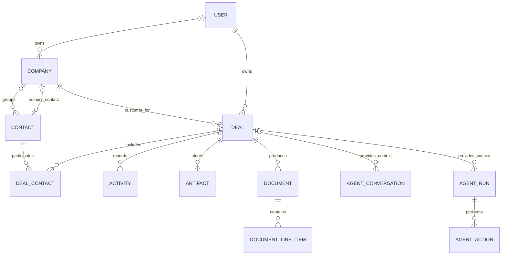
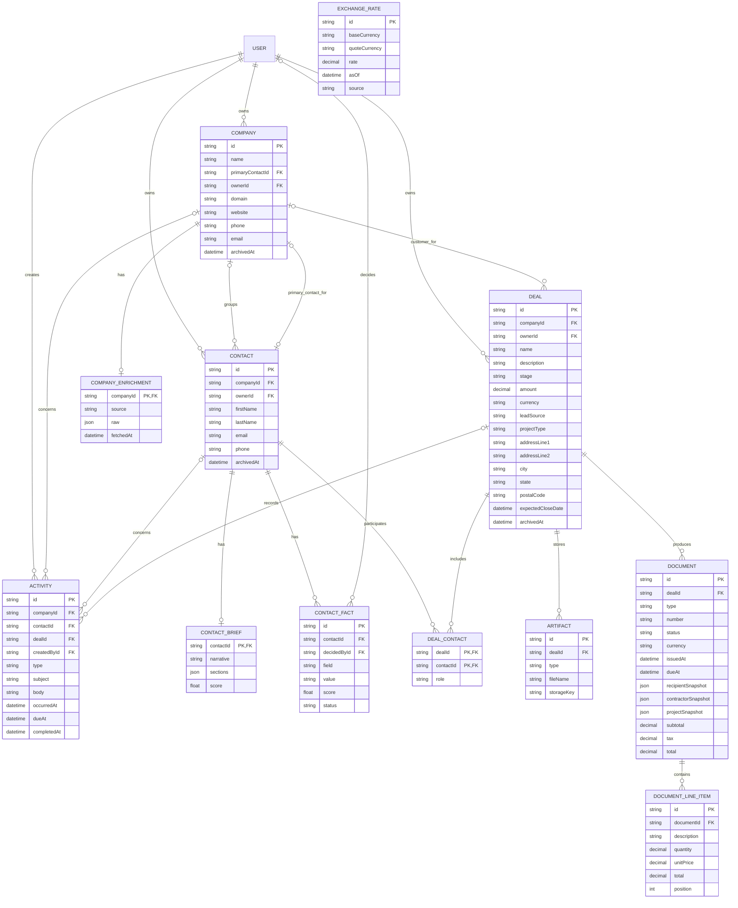
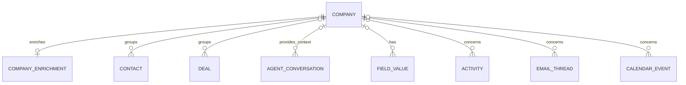
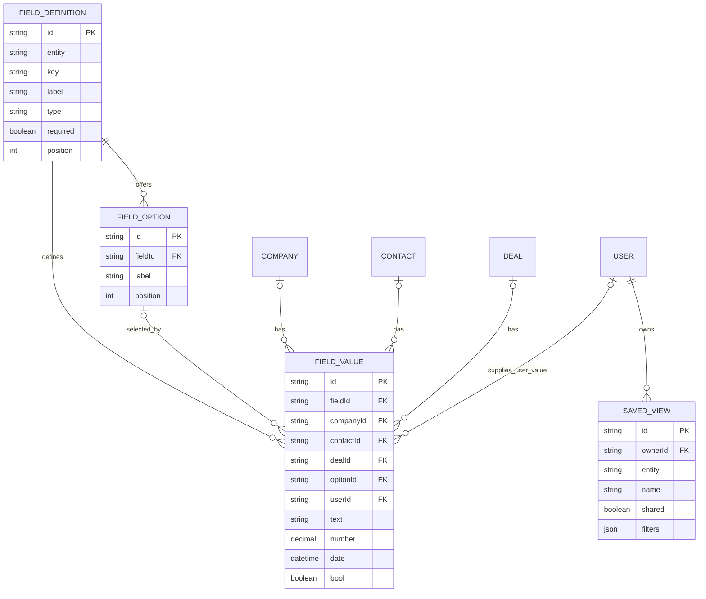
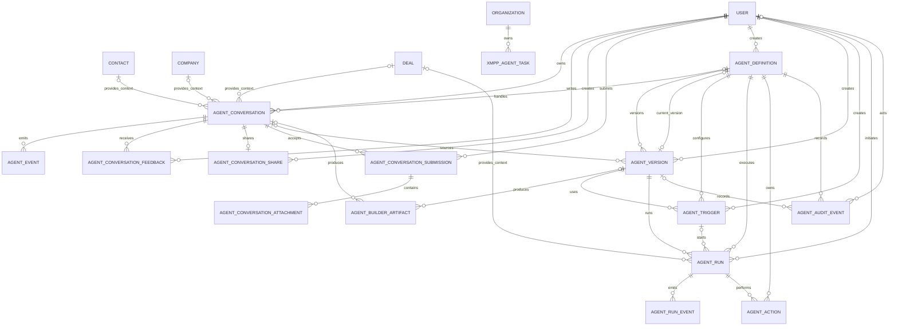
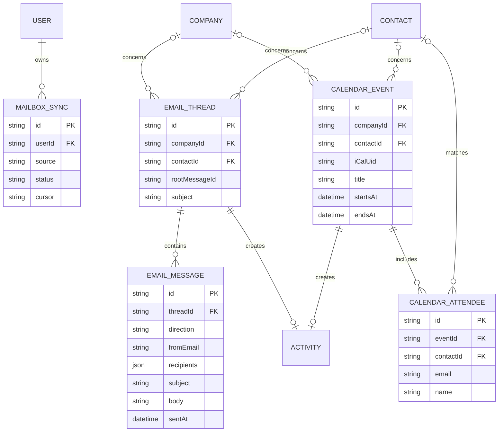
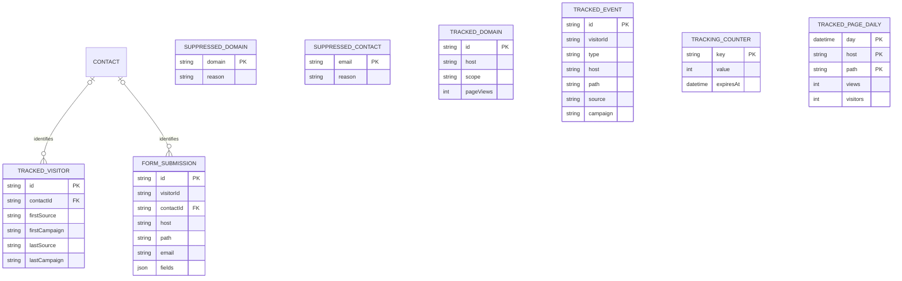
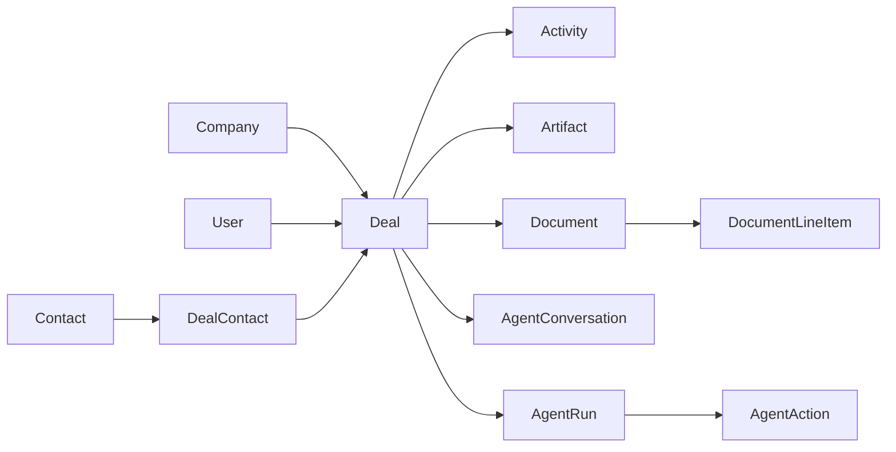

# Existing CompCRM database mapped to construction

Source: [`packages/db/prisma/schema.prisma`](../packages/db/prisma/schema.prisma).

This document maps the existing CompCRM database to the General Contractor POC. It uses the existing physical model names so upstream synchronization does not require table renames.

The database has 64 Prisma models. Only a small group is required for the first construction workflow.

## Construction vocabulary

| Existing model | Construction meaning | POC use |
| --- | --- | --- |
| `User` | GC login | The POC has one User and one human role, GC. This login owns customers, contacts, and Projects, creates activities, and runs bots. |
| `Organization` and `Member` | Inherited access infrastructure | The POC has one Organization, one User, and one Member row with role `owner`. These records provide access only and are not construction workflow entities. |
| `Company` | Customer | Represents a household or business. Every Project must have one customer. |
| `Contact` | Customer person | Represents a homeowner or spouse. |
| `Deal` | Project | Represents the construction opportunity and job from lead through completion. |
| `DealContact` | Project Contact | Connects people to a Project and records one optional role. |
| `Activity` | Project or customer history item | Stores notes, calls, emails, meetings, tasks, and stage changes. |
| `Artifact` | Project file | Stores the reference to a photo, recording, transcript, plan, or other file. |
| `Document` | Estimate or invoice | Stores an issued financial document and fixed recipient, contractor, and Project snapshots. |
| `DocumentLineItem` | Estimate or invoice line | Stores the work or material lines in a Document. |
| `AgentConversation`, `AgentRun`, `AgentAction` | Automation records | Stores bot conversations, executions, and actions, with optional Project context. |

## Core construction relationship

The `Company` to `Deal` line shows the construction rule. The PostgreSQL column is still nullable for upstream compatibility, but the construction API and interface require `Deal.companyId`. A Company cannot be purged while it has Projects.

For a household, `Company.name` can contain the household display name and the spouses are separate `Contact` records. For a business customer, `Company.name` contains the business name and its people are separate `Contact` records. `DealContact` is the authoritative list of people participating in each Project.

## Model inventory

| Area | Models | Direct GC POC role |
| --- | --- | --- |
| GC and CRM | `Company`, `CompanyEnrichment`, `Contact`, `ContactFact`, `ContactBrief`, `Deal`, `DealContact`, `Activity`, `Artifact`, `Document`, `DocumentLineItem`, `ExchangeRate` | `Company`, `Contact`, `Deal`, `DealContact`, `Activity`, `Artifact`, `Document`, and `DocumentLineItem` are in the GC flow. |
| Custom fields and views | `FieldDefinition`, `FieldOption`, `FieldValue`, `SavedView` | Optional CRM support. |
| Agents | `AgentTask`, `XmppAgentTask`, `AgentEvent`, `AgentConversation`, `AgentConversationFeedback`, `AgentConversationShare`, `AgentConversationSubmission`, `AgentConversationAttachment`, `AgentDefinition`, `AgentVersion`, `AgentBuilderArtifact`, `AgentTrigger`, `AgentRun`, `AgentRunEvent`, `AgentAction`, `AgentAuditEvent` | Supports construction automation and the agent builder. |
| Email and calendar | `MailboxSync`, `EmailThread`, `EmailMessage`, `CalendarEvent`, `CalendarAttendee` | Supports customer communication and scheduling. |
| Tracking and forms | `SuppressedDomain`, `SuppressedContact`, `TrackedDomain`, `TrackedVisitor`, `TrackedEvent`, `TrackingCounter`, `TrackedPageDaily`, `FormSubmission` | No required role in the first GC flow. |
| Authentication and workspace | `User`, `Session`, `Account`, `Verification`, `RateLimit`, `Organization`, `WorkspaceProfile`, `Member`, `Invitation`, `SsoProvider`, `Apikey` | Supports sign-in and inherited access infrastructure. |
| Slack | `SlackMemberMatch`, `SlackChannel`, `SlackInstallation`, `SlackWorkspaceGrant` | No required role in the first GC flow. |
| System and telemetry | `AppSetting`, `Install`, `TelemetryMilestone`, `TelemetryCounter` | Application configuration and product telemetry. |

## GC and CRM relations

`ExchangeRate` has no foreign-key relation to another model.

## Company dependency map

| Referencing model | Field | Delete behavior | GC requirement |
| --- | --- | --- | --- |
| `CompanyEnrichment` | `companyId` | Cascade | None. |
| `Contact` | `companyId` | Set null | Optional household or business grouping. Project participation is stored in `DealContact`. |
| `Deal` | `companyId` | Set null in PostgreSQL | Required by the construction API and interface. |
| `AgentConversation` | `companyId` | Cascade | None for Project conversations. |
| `FieldValue` | `companyId` | Cascade | None for Contact or Project values. |
| `Activity` | `companyId` | Cascade | None for Contact or Project activities. |
| `EmailThread` | `companyId` | Set null | None when linked through Contact. |
| `CalendarEvent` | `companyId` | Set null | None when linked through Contact. |
| `AgentTask` | `companyId` | No declared foreign key | None for Project tasks. |

`Company.primaryContactId` also points to `Contact`. Company is the required customer record for a construction Project. The physical `Deal.companyId` column remains nullable only for upstream compatibility.

## Construction workflow mapping

### Lead intake

1. Create or select one `Company` customer. Use it for either a household or business.
2. Create each person as a `Contact`. `Contact.companyId` can group the person under the customer, but this link is not the Project relationship.
3. Create the `Deal` Project with the customer in `Deal.companyId`, the GC owner in `Deal.ownerId`, and `stage = LEAD`.
4. Add each participating person through `DealContact`.
5. Set `Company.primaryContactId` when the main customer contact is known.
6. Store intake notes, calls, meetings, or follow-up work as `Activity` records.

### Sales and production

`Deal.stage` supplies the current POC lifecycle:

| Value | Construction meaning |
| --- | --- |
| `LEAD` | New opportunity. |
| `ESTIMATING` | Scope and price are being prepared. |
| `CONTRACTED` | The customer accepted the work. |
| `IN_PROGRESS` | Construction is active. |
| `COMPLETE` | Construction is complete. |
| `LOST` | The opportunity will not proceed. |

`Deal.projectType` stores the work category, such as kitchen remodeling or patio. The job-site address stays on `Deal`. A separate Property table is not required for this POC.

### Project contacts

The `DealContact` primary key is `(dealId, contactId)`. One person can appear once in a Project and has one optional `role`. `Company.primaryContactId` identifies the main customer contact for the household or business.

This structure supports two spouses without a Household table. Both spouses are Contacts, both link to the same Project, and the Project belongs to the household customer stored in `Company`.

### Estimates and invoices

Create one `Document` for each estimate or invoice. Add its rows through `DocumentLineItem`.

The `recipientSnapshot`, `contractorSnapshot`, and `projectSnapshot` fields preserve the printed information at issue time. Later changes to the customer, Contacts, or Project do not change an issued document.

### Construction automation

Use `AgentConversation` for an automation conversation. Link it to `Deal` when the conversation concerns a Project. `AgentRun` stores each execution and can also link to the Project. `AgentAction` stores each planned or completed action from the run.

The existing agent framework is shared by construction automations. Separate construction bot tables are not required.

### Communication and scheduling

`EmailThread` and `CalendarEvent` can link to a Company or Contact. Their synchronized events can also create an `Activity`. These tables do not link directly to `Deal`, so the Project timeline uses the related `Activity.dealId` when Project context is required.

## Required construction rules

| Rule | Current enforcement |
| --- | --- |
| Every Project has one customer. | The construction API and interface require `Deal.companyId`. PostgreSQL still permits null for upstream compatibility. |
| A customer with Projects cannot be purged. | The Company service rejects purge until its Projects are deleted. |
| A Project can have several people. | `DealContact` is a many-to-many join between `Deal` and `Contact`. |
| A person appears once per Project. | Composite primary key on `DealContact(dealId, contactId)`. |
| A Company has at most one primary contact. | `Company.primaryContactId` points to one Contact. |
| Issued documents keep their original printed details. | Required JSON snapshots on `Document`. |
| Project files are deleted with the Project. | `Artifact.dealId` uses cascade delete. |
| Documents and their lines are deleted with the Project. | `Document.dealId` and `DocumentLineItem.documentId` use cascade delete. |

## Custom fields and saved views

## Agent and bot relations

### Agent models

| Model | Main role |
| --- | --- |
| `AgentTask` | Legacy enrichment or background work queue. Its `contactId`, `companyId`, and `dealId` fields are scalar IDs without declared Prisma relations. |
| `XmppAgentTask` | XMPP task lifecycle for an Organization. |
| `AgentEvent` | Conversation event stream. |
| `AgentConversation` | User conversation linked optionally to Contact, Company, Deal, and AgentDefinition. |
| `AgentConversationFeedback` | Per-message user rating. |
| `AgentConversationShare` | Share token for a conversation. |
| `AgentConversationSubmission` | Durable user command submission. |
| `AgentConversationAttachment` | Binary attachment on a submission. |
| `AgentDefinition` | Agent identity and current version. |
| `AgentVersion` | Versioned instructions, manifest, model, and sandbox policy. |
| `AgentBuilderArtifact` | Versioned builder file content. |
| `AgentTrigger` | Manual, schedule, event, or webhook trigger. |
| `AgentRun` | One agent execution, optionally linked to a Deal. |
| `AgentRunEvent` | Ordered run event stream. |
| `AgentAction` | External or internal action attempted by a run. |
| `AgentAuditEvent` | Agent configuration audit history. |

## Email and calendar relations

## Tracking and forms

`TrackedEvent.visitorId` and `FormSubmission.visitorId` do not have declared Prisma relations to `TrackedVisitor`.

## Authentication, workspace, Slack, and system models

```mermaid
erDiagram
    USER ||--o{ SESSION : authenticates
    USER ||--o{ ACCOUNT : uses
    USER ||--o{ MEMBER : joins
    USER ||--o{ INVITATION : sends
    USER o|--o{ SSO_PROVIDER : configures
    USER ||--o{ APIKEY : owns
    USER ||--o| SLACK_MEMBER_MATCH : matches

    ORGANIZATION ||--o{ MEMBER : includes
    ORGANIZATION ||--o{ INVITATION : issues
    ORGANIZATION ||--o{ XMPP_AGENT_TASK : owns

    USER {
        string id PK
        string name
        string email
        boolean emailVerified
    }

    SESSION {
        string id PK
        string userId FK
        string token
        datetime expiresAt
    }

    ACCOUNT {
        string id PK
        string userId FK
        string providerId
        string accountId
    }

    VERIFICATION {
        string id PK
        string identifier
        string value
        datetime expiresAt
    }

    RATE_LIMIT {
        string id PK
        string key
        int count
    }

    ORGANIZATION {
        string id PK
        string name
        string slug
    }

    WORKSPACE_PROFILE {
        string id PK
        string website
        string narrative
        json sections
    }

    MEMBER {
        string id PK
        string organizationId FK
        string userId FK
        string role
    }

    INVITATION {
        string id PK
        string organizationId FK
        string inviterId FK
        string email
        string role
        string status
    }

    SSO_PROVIDER {
        string id PK
        string userId FK
        string organizationId
        string providerId
        string domain
    }

    APIKEY {
        string id PK
        string referenceId FK
        string key
        boolean enabled
    }

    SLACK_MEMBER_MATCH {
        string id PK
        string crmUserId FK
        string slackUserId
        string slackHandle
    }

    SLACK_CHANNEL {
        string id PK
        string name
        boolean available
        boolean isPrivate
    }

    SLACK_INSTALLATION {
        string installerId PK
        string teamId
        string userToken
        string userScopes
    }

    SLACK_WORKSPACE_GRANT {
        string id PK
        string teamId
        string userToken
        string userScopes
    }

    APP_SETTING {
        string id PK
        string agentModelId
        string reportingCurrency
        boolean trackingPaused
    }

    INSTALL {
        string id PK
        string uuid
        string version
    }

    TELEMETRY_MILESTONE {
        string step PK
        datetime reachedAt
    }

    TELEMETRY_COUNTER {
        string name PK
        int count
    }
```

The following models are independent stores with no declared Prisma relation: `SlackChannel`, `SlackInstallation`, `SlackWorkspaceGrant`, `Verification`, `RateLimit`, `WorkspaceProfile`, `AppSetting`, `Install`, `TelemetryMilestone`, and `TelemetryCounter`.

`SsoProvider.organizationId` is a scalar field without a declared relation to `Organization`.

## GC POC boundary

The first GC flow directly depends on these physical models:

The physical `Deal` model is Project in the product. Company represents the household or business customer. The construction API requires it for every new Project. Company deletion is blocked while Projects reference it. The PostgreSQL column stays nullable for upstream compatibility.
